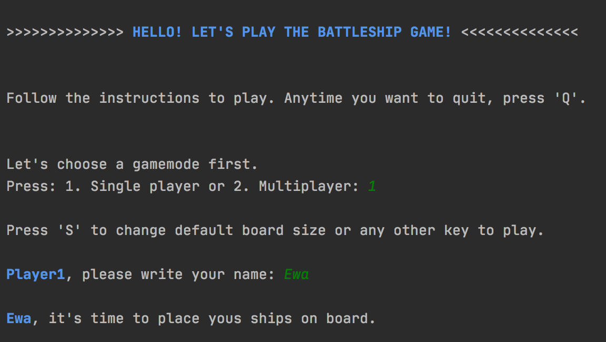
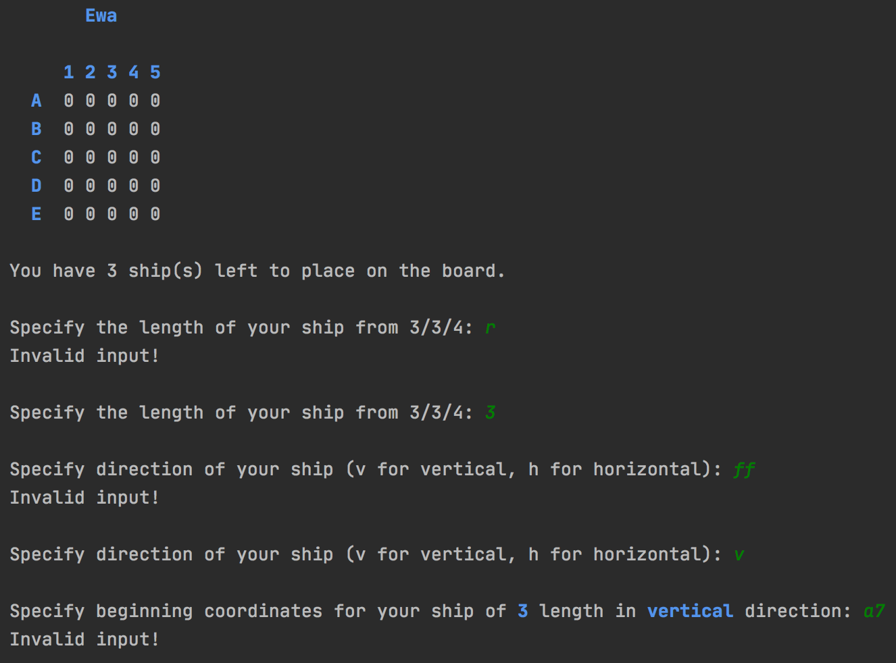
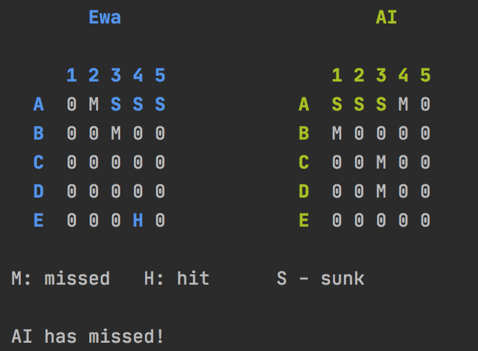
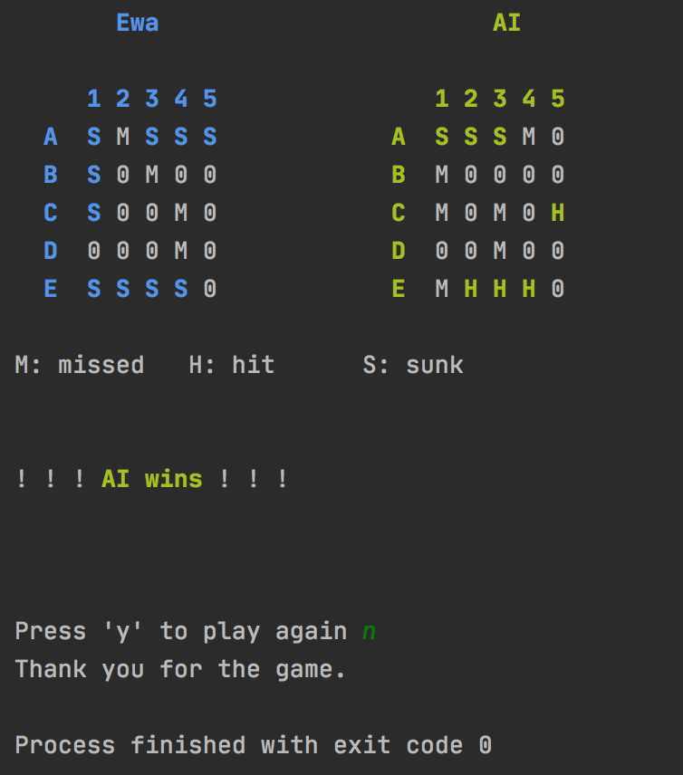

# Battleship

_Project developed in June 2020 by Ewa Żeleńska-Olczak and Joanna Rzeszótko-Doniec. (Codecool course)_ 

## Project assumptions
- implementation of a popular game battleship
- any size of the board
- modules: HUMAN-HUMAN, HUMAN-AI, AI-AI

